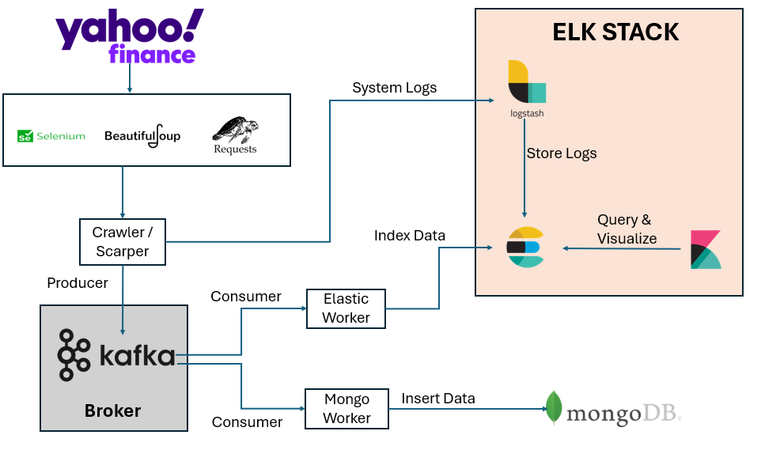

# Scalable Web Crawler & Scraper for Yahoo Finance

A highly scalable, decoupled, microservices-style Python web crawler optimized for scraping articles and metadata. The project leverages **Apache Kafka** to handle ingestion pipelines, **MongoDB** for persistence, and the **ELK Stack (Elasticsearch, Logstash, Kibana)** for system logging and full-text search indexing. 

---

## System Architecture

### Component Details
*   **Crawler / Scraper (Producer)**: Crawls sites, parses URLs, respects `robots.txt`, and uses Selenium to handle dynamically rendered content. Reuses Selenium WebDriver instances to avoid performance degradation. Scraped articles are published immediately to a Kafka topic.
*   **Apache Kafka**: Serves as the central messaging backbone. It decouples the speed of the crawler (fast network actions) from the databases (slower write I/O).
*   **MongoDB Worker (Consumer)**: Listens to the Kafka queue and persists raw articles into MongoDB.
*   **Elastic Worker (Consumer)**: Listens to the Kafka queue and indexes articles into Elasticsearch for instant full-text search capabilities.
*   **ELK Stack**: 
    *   **Logstash**: Collects system logs via UDP from the Crawler.
    *   **Elasticsearch**: Stores both log data and crawled articles.
    *   **Kibana**: Offers real-time dashboards to monitor crawler health, logs, and query indexed articles.

---

## Features

1.  **High-Performance Scraping**:
    *   Optimized crawler queue utilizing Python's `collections.deque` (O(1) operations).
    *   Shared, lazy-initialized Selenium WebDriver to eliminate bootstrap overhead.
2.  **Robots.txt Compliance**: Automatically reads, caches, and respects target site crawl rules.
3.  **Event-Driven Pipeline**: Decoupled ingestion ensures that database downtime or bottlenecks do not stop or slow down the crawler.
4.  **Centralized Logging**: Seamlessly ships Python application logs to Logstash using a UDP handler.
5.  **Full-Text Search & Analytics**: Query scraped articles dynamically using Kibana dashboards.

---

## Monitoring and Search

*   **Kibana UI**: Open [http://localhost:5601](http://localhost:5601) in your browser.
    *   Navigate to **Stack Management** > **Data Views** to create data views for logs (`logstash-*`) or scraped data (`scraped-articles-*`).
    *   Use the **Discover** tab to search and analyze logs and articles in real time.
*   **MongoDB**: Access your database at `mongodb://localhost:27017` using MongoDB Compass or other shell utilities.
